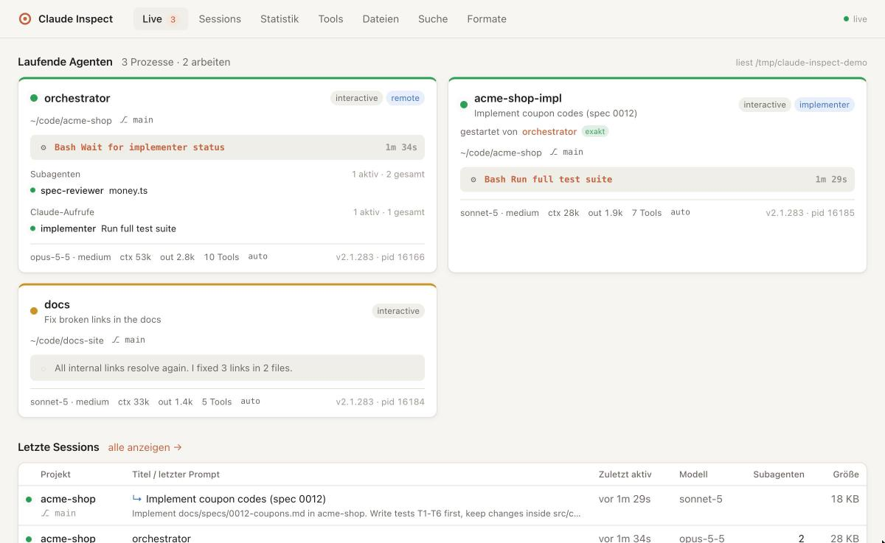
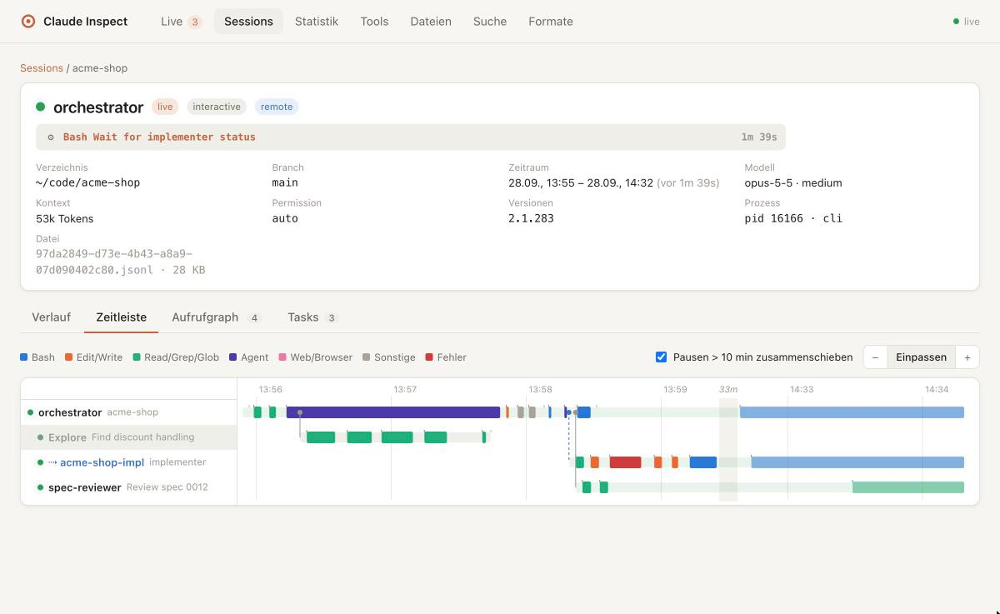
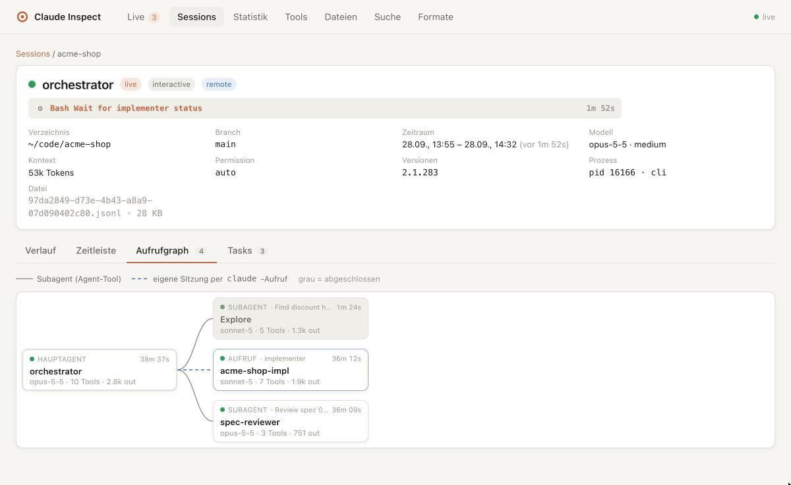
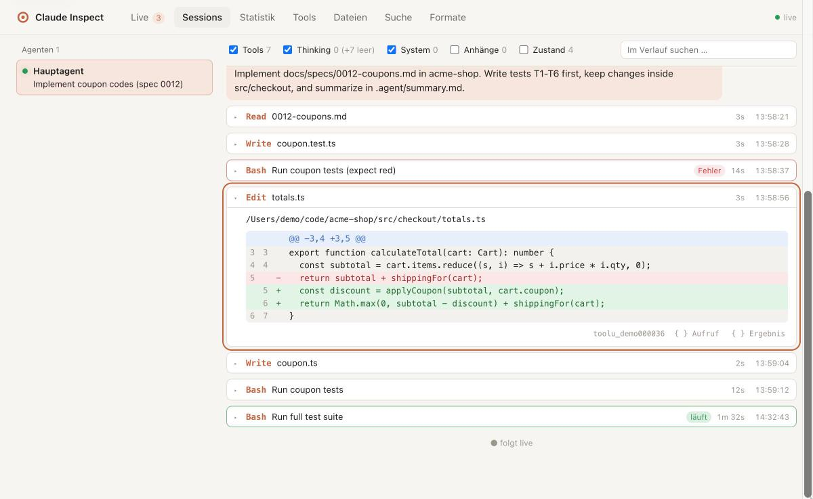
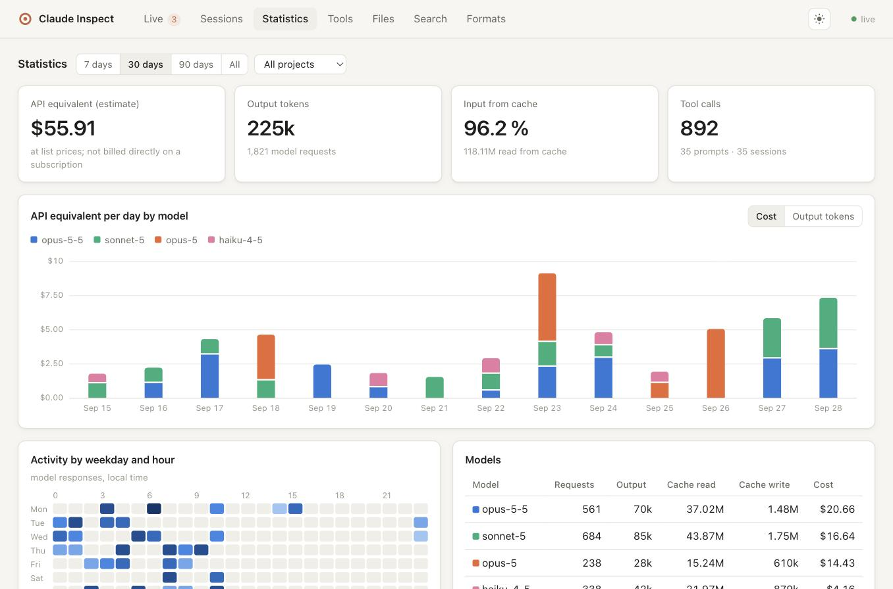
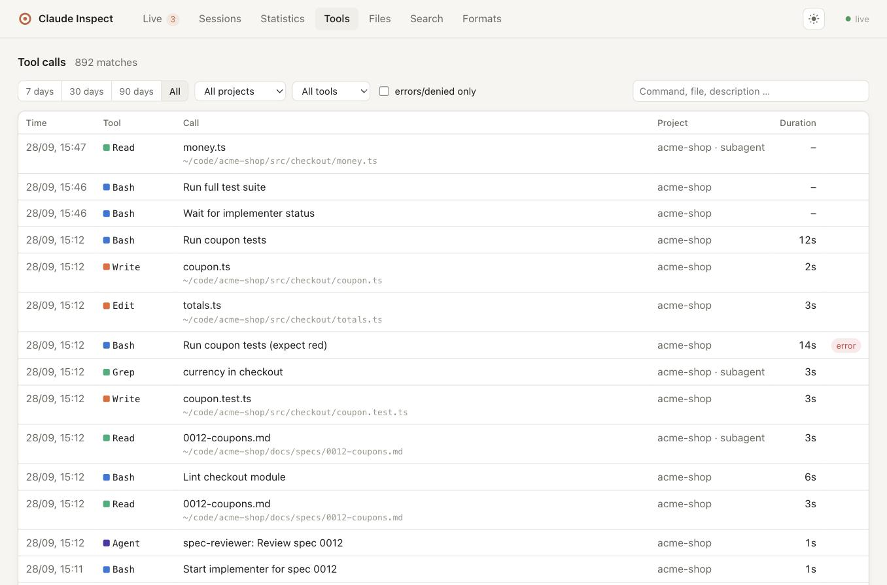
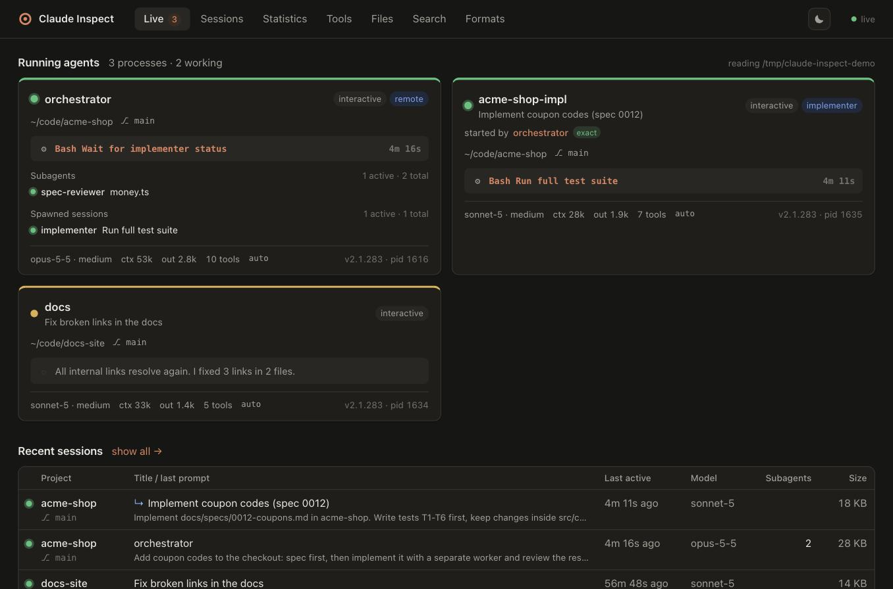

# claude-inspect – live dashboard & history viewer for Claude Code agents

[](LICENSE)


**See what your [Claude Code](https://claude.com/claude-code) agents are doing – right now and in the past.**
claude-inspect is a local web UI that reads the files Claude Code already writes to `~/.claude`
and shows running sessions, subagents, `claude -p` worker sessions started by other agents,
every tool call with its result, timelines, a call graph, token usage and a searchable history.

It is **read-only and passive**: no hooks, no settings changes, no proxy, no data leaves your machine,
and the tool itself stores nothing.

> Deutsch: [README.de.md](README.de.md) · Design notes (German): [KONZEPT.md](KONZEPT.md)



## Why

If you run several Claude Code sessions, background jobs and subagents in parallel – or let an
orchestrating agent start dedicated `claude -p` / `claude --agent …` worker sessions – it quickly
becomes hard to tell *who is doing what*. claude-inspect answers:

- Which agents are running, which are idle, which crashed?
- What is each agent doing at this moment (tool, command, since when)?
- **Who started whom?** Subagents *and* separate `claude` processes spawned via Bash are linked to the exact tool call that started them.
- What did a tool call receive and return? (Bash output, file diffs, subagent results …)
- How much did a session cost (API list-price equivalent), which tools fail, which files are touched most?

## Features

| | |
|---|---|
| **Live dashboard** | Running Claude Code processes with status (busy/idle), current activity, pending tools, background jobs with their running shells, active subagents and spawned worker sessions, model, context size, tokens, permission mode, Remote Control. Updates via Server-Sent Events. |
| **Transcript viewer** | Full conversation with per-tool renderers (Bash output, Edit/Write as diff, Read with line numbers, Agent with link to the subagent), filters, search, and the raw JSON of every line (secrets masked). Follows live sessions. |
| **Agent tree & call graph** | Main agent → subagents (nested) → `claude` sessions started via Bash, including fork/resume relations. Finished agents are greyed out. |
| **Timeline** | One lane per agent, tool calls as bars, spawn links between lanes, idle gaps > 10 min collapsed, zoom. Click a bar to jump to the call. |
| **Spawn linking** | Links sessions started by `claude -p …` to the calling tool use via the process tree (exact), `--session-id`, prompt text, `--agent`, time window and working directory – with a confidence label. |
| **Statistics** | API list-price estimate, tokens per model/day/project, cache share, activity heatmap, tool statistics with error rate and p95 duration. |
| **Tool explorer & files** | Every tool call across all sessions, filterable; which files agents read, edited or wrote. |
| **Full-text search** | Across all transcripts, subagents and the prompt history (including prompts of sessions Claude Code already cleaned up). |
| **Task boards** | The TaskCreate/TaskUpdate list of a session with dependencies. |
| **Format detection & schema drift** | Claude Code's file formats change between versions. Each record is decoded individually by versioned decoders; unknown records and fields are never dropped and are listed on the *Formats* page. |
| **Dark mode** | Light, dark or system theme, remembered per browser. |

<table>
<tr>
<td></td>
<td></td>
</tr>
<tr>
<td></td>
<td></td>
</tr>
</table>

<table>
<tr>
<td></td>
<td></td>
</tr>
</table>

*All screenshots show the built-in demo data set (`npm run demo`), not real sessions.*

## Quick start

Requirements: Node.js ≥ 20, macOS or Linux, Claude Code writing to `~/.claude`.

```bash
git clone https://github.com/brokoskokoli/claude_inspect.git
cd claude_inspect
npm install
npm run build   # builds the web UI and compiles the server to plain JavaScript
npm start       # http://localhost:7717 – opens the browser
```

`npm start` prints a URL with a random access token (`?t=…`); the browser keeps it as a cookie.
For a stable URL use a fixed token (`CLAUDE_INSPECT_TOKEN=my-secret npm start`) or none at all
(`node dist/app/server/main.js --no-auth`, see *Security* below).
Other data directory: `CLAUDE_CONFIG_DIR=/path/to/.claude`.

### Run it permanently (autostart)

```bash
npm run build
npm run service:install              # port 47717, or: npm run service:install -- --port 50000
```

This registers a user service – a LaunchAgent on macOS, a `systemd --user` unit on Linux – that
starts at login, restarts after a crash and serves **http://localhost:47717** without a token,
ready for a bookmark. `npm run service:status` shows state and log file,
`npm run service:uninstall` removes it. After pulling updates, run `npm run build` and the service
picks them up on its next restart (`npm run service:install` again restarts it immediately).

### Try it without your own data

```bash
npm run demo    # fictional ~/.claude with running agents + 2 weeks of history, http://127.0.0.1:7718/?t=demo
```

Light, dark or follow the OS – switch with the button in the header (the choice is remembered).

### Status indicators

| | |
|---|---|
| green, pulsing dot | working right now |
| amber dot | process alive, waiting for input |
| grey check mark | finished normally |
| red cross | ended with an API error (single failing tool calls don't count – the agent carries on) |
| grey ring | no activity for 10 min and never finished, e.g. interrupted |
| grey dot | process has ended |

## How it works

```
~/.claude/sessions/<pid>.json          running processes (+ ps liveness check, process tree)
~/.claude/projects/*/<session>.jsonl   transcripts (read incrementally, parsed per record)
~/.claude/projects/*/<session>/subagents/agent-*.jsonl + .meta.json
~/.claude/jobs/*/state.json, timeline.jsonl, daemon/roster.json   background jobs, forks
~/.claude/tasks/<session>/*.json       task lists
~/.claude/history.jsonl                prompt history
        │
        ▼
FormatRegistry → versioned decoders → normalized model → REST + SSE → Svelte UI
```

- **Per-record format detection:** every decoder scores a record (`type`, version range, structure); the best one wins, a fallback keeps unknown records. Adding support for a new Claude Code version = adding a decoder file. See [docs/FORMATS.md](docs/FORMATS.md).
- **In memory only:** startup reads process/job data and file heads (< 1 s); the full history (hundreds of MB) is aggregated in the background in a few seconds and then followed incrementally.
- **Privacy & security:** listens on `127.0.0.1` only (never reachable from the network), rejects requests whose `Host` header isn't `localhost`/`127.0.0.1` (DNS rebinding), sends no CORS headers (other websites in your browser can't read the API), is read-only, never reads credential files (`*.key`, `daemon/auth`, `ide/*.lock`, …) and masks token/secret fields in the raw view. The access token is an extra layer against *other local processes or users* on the same machine; on a single-user machine `--no-auth` (used by the autostart service) is a reasonable trade-off. Cost figures are estimates from public API list prices – with a subscription you do not pay these amounts directly.

## Development

```bash
npm run dev        # API without token on :7717 (tsx watch, no build needed)
npm run dev:web    # Vite dev server on :5173 with proxy to the API
npm run check      # type checks (server + Svelte)
npm test           # decoder snapshots per Claude Code version, spawn linker, history aggregator
npm run snapshot   # terminal output: running agents + schema drift
npm run fixtures   # regenerate anonymized test fixtures from your local ~/.claude
```

```
src/shared/   domain types, tool summaries, price table (server + UI)
src/server/   formats/ (decoders + registry) · sources/ (files, processes, jobs, spawn linker)
              model/ (activity, timeline data) · history/ (aggregator, search) · http.ts, inspector.ts
web/          Svelte 5 UI
tests/        anonymized fixtures per Claude Code version, snapshots, tests
scripts/      fixture generator, demo data generator
```

Contributions welcome – especially decoders for new Claude Code versions (run `npm run fixtures` and
`npm test`, then check the *Formats* page for unknown fields).

## Disclaimer

Not affiliated with or endorsed by Anthropic. Claude Code's local file formats are undocumented and
may change at any time; claude-inspect is designed to degrade gracefully (unknown data is shown raw).

## License

[MIT](LICENSE)
